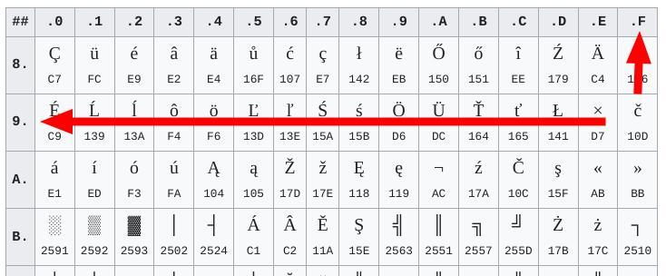

+++
title = "Localizing 'Indiana Jones and the Fate of Atlantis' 30 years after release"
date = 2025-02-22
draft = false
tags = ['digital archeology', 'retro','localization','game']
author = "retro"
authorLinkG = "https://github.com/simi"
authorLinkX = "https://x.com/retrorubies"
articleClass = "anim ij"
summary = 'Ever wondered what it takes to fully [localize](https://en.wikipedia.org/wiki/Localization) a 30-year-old game? Dive into journey of localizating [Indiana Jones and the Fate of Atlantis](https://en.wikipedia.org/wiki/Indiana_Jones_and_the_Fate_of_Atlantis), where autumn boredom sparks a fascinating challenge. From [reverse-engineering](https://en.wikipedia.org/wiki/Reverse_engineering) game files to painting custom characters into retro fonts, this post unpacks the tools, tricks, and tenacity needed to make a classic adventure fully accessible in a new language. How do you "teach" a game to display characters it was never designed for? And why might you end up loving the process as much as the result?'
+++

 is recommended to be played while reading.")

## Prologue

I hate autumn! All the free time you can spend in summer chatting pointlessly over beer and liquor, in the pub, in the garden, with family and friends, suddenly has nothing to fill it. And so I start looking for other forms of entertainment - digital ones. I don't even know why, but in the autumn of 2022 I had the idea of translating the game [Peglin](https://gedig.itch.io/peglin) into English. I started researching how such community translations are made. I discovered [prekladyher.eu (now moved to hernipreklady.cz)](https://hernipreklady.cz/) and you can guess what happened next by reading the title. Right, I never translated Peglin. However, I did come across [request for help](https://prekladyher.eu/vlakno/indiana-jones-and-the-fate-of-atlantis.4333/#post-54513) with [localising](https://en.wikipedia.org/wiki/Language_localisation) a 30 years old game.

*Author's note: Yes, the date of the request (and my reply) doesn't really fit with autumn. But that doesn't negate the fact that I hate autumn.*

## Getting the game

I played the game [Indiana Jones and the Fate of Atlantis](https://en.wikipedia.org/wiki/Indiana_Jones_and_the_Fate_of_Atlantis) (aka Indy4) for a while when I was a kid, but since it was in English, I didn't really know what was going on. However, I got the Czech version of the previous game in the series - [Indiana Jones and the Last Crusade](https://en.wikipedia.org/wiki/Indiana_Jones_and_the_Last_Crusade) (aka Indy3) - and it made me pass out for a really long time. I knew what to expect. Classic [Lucasfilm Games](https://www.lucasfilm.com/what-we-do/games/) adventure game based on the [SCUMM](https://en.wikipedia.org/wiki/SCUMM) engine.

I bought the game (*at [GOG](https://www.gog.com/game/indiana_jones_and_the_fate_of_atlantis) and just to be on the safe side, I bought [Indy3](https://www.gog.com/en/game/indiana_jones_and_the_last_crusade) to settle some old debts*). Here was the first challenge for me. Indy4 has been released in several versions. GOG sells a so-called "talkie" version, which includes a full English voice-over. Just to be sure, I found the original DOS version on archive.org and compared them. The files are the same and this is the version I was looking for. I successfully installed and ran the game (via [ScummVM](https://www.scummvm.org/) on Linux).

According to the [ScummVM wiki](https://wiki.scummvm.org/index.php/Indiana_Jones_and_the_Fate_of_Atlantis) Indy4 contains 3 main data files. I found them in the game directory (in my case `/opt/Games/Indiana Jones and the Fate of Atlantis`) in the `data` folder.

```
[retro@retro  Indiana Jones and the Fate of Atlantis]❤ ls -lh data
total 153M
-rw-r--r--. 1 retro retro  12K Nov 12 16:38 ATLANTIS.000
-rw-r--r--. 1 retro retro 9.4M Nov 12 16:38 ATLANTIS.001
-rw-r--r--. 1 retro retro 143M Oct 15 14:00 MONSTER.SOU
drwx------. 2 retro retro 4.0K Oct 15 14:00 other
```

By simple deduction (based on the size of the files) I assumed that the `MONSTER.SOU` file would contain the voiceover. I confirmed this by comparing it with the files from the no-voice-over version, where this file is completely missing. I also looked at the [original translation](https://www.idnes.cz/hry/cestiny/hry/indiana-jones-4-and-the-fate-of-atlantis.A061005_59388_bw-cestiny-hry_bw) (without Czech localisation). That contains only the files `ATLANTIS.000` and `ATLANSTIS.001`. I downloaded the translation and applied it. Now I have the game in Czech, but the Czech characters (`áčďéěěíňóřštúúúýž` and `ÁČĎÉĚĚĚĚÍÍÍĚŘŠŤÚŮÝŽ`) are missing.

**And that's the challenge for me. "Persuade" this 30 year old game to correctly render, for example, `č`.** The 2006 translation replaces all characters with diacritics with characters without diacritics. So instead of `Stlač MEZERNÍK`, the game will render `Stlac MEZERNIK`.

 translation contains c instead of č")

## Working with game files

Although working on a 30 year old game may seem to have only disadvantages, there are some advantages. People have had 30 years (*30 autumns*) to disassemble and document this game (without source code) using [reverse engineering](https://en.wikipedia.org/wiki/Reverse_engineering). And because of this, there is a toolkit for SCUMM games called [scummtr](https://github.com/dwatteau/scummtr). A few moments of searching the [forums](https://forums.scummvm.org/), a few questions asked on the [ScummVM Discord](https://discord.gg/4cDsMNtcpG), and finally reading the [README](https://github.com/dwatteau/scummtr/blob/main/README.md)... and now I have an idea of what these tools can do.

First of all, I need to export the game texts. The `scummtr` program with the `-o` parameter is useful for this. The other way round you can import the text into the game using the same program with the `-i` parameter.

```
$ /cesta/k/scummtr -g atlantis -p /cesta/k/indy4 -r -o -f texts.txt
$ /cesta/k/scummtr -g atlantis -p /cesta/k/indy4 -r -i -f texts.txt
```

Since I already know that I will not enjoy typing this command (or the others) over and over again, and since I assume I will be using it a lot, I will start to organise it a bit. On Linux, a good (my) choice is [Makefile](https://en.wikipedia.org/wiki/Make_(software)). *On Windows, a [bat](https://en.wikipedia.org/wiki/Batch_file) file would probably do the trick.* I also assume I'll need to run the game for testing, and as a bonus, I can specify file paths to reduce commands to a bare minimum. *I will be adding more tasks to the file continuously.*


```
INDY4_DATA_PATH="/opt/Games/Indiana Jones and the Fate of Atlantis/data"
SCUMMTR_BIN_PATH="/opt/scummtr/build/bin"

test:
	scummvm -p $(INDY4_DATA_PATH) --auto-detect

export-text:
	$(SCUMMTR_BIN_PATH)/scummtr -g atlantis -p $(INDY4_DATA_PATH) -r -o -f texts.txt

import-text:
	$(SCUMMTR_BIN_PATH)/scummtr -g atlantis -p $(INDY4_DATA_PATH) -r -i -f texts.txt
```

Simply running `make export-text` will create a `texts.txt` file in the same folder with the texts from the game. The texts are already in Czech without diacritics, because I applied the original Czech to the game. As an simple test, just find the test string `Stlac MEZERNIK` in the file, rewrite it to `Stlač MEZERNIK`, save it and import it back into the game by running `make import-text`.

*Note that I'm using the Notepad++ editor (via Wine, there's no native Linux version) and OEM 852 encoding. I'll explain how I figured this out later, it was one of the hardest nuts to crack. At this stage, any era (DOS) encoding would work.

 modified accented text, (2) OEM 852 encoding")

Finally, just run `make test`, hit the space bar after a while (which will pause the game) and see what the game renders. Since the challenge is to add diacritics, I assume the game won't render `č`, and I'm right. Instead of the `č` character, the game will render nothing, to be safe.

 the game misses the č")

# Modifying the game font

The `scummtr` toolkit includes a `scummfont` tool which (at least according to the `README`) can export a game font from game files as a [bitmap](https://en.wikipedia.org/wiki/Bitmap) (bmp format, *this will also open Painting*). It took me a while to understand how this works. Because this tool is not applied directly to the game files (`ATLANTIS.00X`), but to the font files. Eventually I found out (searching, reading forums, Discord, ...) that these can be accessed using the `scummrp` tool with the `-o` parameter, which can "unpack" the `ATLANTIS.00X` files. And it can also "wrap" them with the `-i` parameter. Again, I edit the `Makefile`, adding two tasks and selecting `export` as the destination folder.

```
export-data:
	$(SCUMMTR_BIN_PATH)/scummrp -g atlantis -o -p $(INDY4_DATA_PATH) -d export

import-data:
	$(SCUMMTR_BIN_PATH)/scummrp -i -g atlantis -p $(INDY4_DATA_PATH) -d export
```

In the `export` folder I finally find the `CHAR_000X` files in the `DISK_0001/LECF/LFLF_0068` directory. The `scummfont` program can work with them. With the `o` parameter it can convert game fonts to bitmap and with the `i` parameter it can convert bitmap back to game font. The `Makefile` grows again. *Slight spoiler: this is the last expansion of the Makefile.

```
export-fonts:
	$(SCUMMTR_BIN_PATH)/scummfont o export/DISK_0001/LECF/LFLF_0068/CHAR_0001 font-1.bmp
	$(SCUMMTR_BIN_PATH)/scummfont o export/DISK_0001/LECF/LFLF_0068/CHAR_0002 font-2.bmp
	$(SCUMMTR_BIN_PATH)/scummfont o export/DISK_0001/LECF/LFLF_0068/CHAR_0003 font-3.bmp
	$(SCUMMTR_BIN_PATH)/scummfont o export/DISK_0001/LECF/LFLF_0068/CHAR_0004 font-4.bmp
	$(SCUMMTR_BIN_PATH)/scummfont o export/DISK_0001/LECF/LFLF_0068/CHAR_0005 font-5.bmp

import-fonts:
	$(SCUMMTR_BIN_PATH)/scummfont i export/DISK_0001/LECF/LFLF_0068/CHAR_0001 font-1.bmp
	$(SCUMMTR_BIN_PATH)/scummfont i export/DISK_0001/LECF/LFLF_0068/CHAR_0002 font-2.bmp
	$(SCUMMTR_BIN_PATH)/scummfont i export/DISK_0001/LECF/LFLF_0068/CHAR_0003 font-3.bmp
	$(SCUMMTR_BIN_PATH)/scummfont i export/DISK_0001/LECF/LFLF_0068/CHAR_0004 font-4.bmp
	$(SCUMMTR_BIN_PATH)/scummfont i export/DISK_0001/LECF/LFLF_0068/CHAR_0005 font-5.bmp
```

Bitmaps can now be explored visually. I use [GIMP](https://www.gimp.org/), but the regular [Paint](https://cs.wikipedia.org/wiki/Malov%C3%A1n%C3%AD_(Windows)) available in Windows would really do the trick here. The font I'm looking for (because I want to learn it `č`) looks like the font in the file `font-1.bmp`. The bitmap contains a "long noodle" of characters underneath. In this font, each character has a 13x16px "box" and some of the "boxes" are empty (I guess that's where the game looks for the missing characters and renders nothing).


To check that the edited bitmap is correctly converted back into a font and successfully imported into the game, I edit the 'S' character, for example.

 original S character, (2) modified S character for test")

Well, a properly used `Makefile` (`make import-fonts import-data import-text`) will now do everything we need. It's important to run `import-fonts' and then `import-data', because `import-fonts' saves the font back to the unpacked data in game format, and `import-data' packs and copies that data back to the game folder.

 modified game-rendered character")

## Font localization

In GIMP (or Paint), all you have to do is paint the Czech characters into the "boxes" provided, and the challenge is over. But where should I paint the `č`?

*Author's note: I sweated a lot on this one and almost gave up a couple of times.

My first idea was to try "[brute force](https://en.wikipedia.org/wiki/Brute-force_attack)". Draw something unique (like a symbol or a number) in each empty "slot" in the bitmap, edit the test text continuously, and note which character is drawn in which position in the bitmap. I started editing the bitmap in this way. But I didn't want to repeat this rather time-consuming process thirty times. Fortunately, I noticed that there were German characters in the bitmap (for example `ß`) and that there were numbers in a sequence, but the letters were "random". 

This led me to the clue that the characters are not randomly in the bitmap, but according to some system. A quick look at the [ASCII table](https://cs.wikipedia.org/wiki/ASCII#Tabulka_ASCII_k%C3%B3d%C5%AF) and even there the numbers are in a row and then the letters are "random". So I compared the position of the random character in the bitmap and in the ASCII table. For example, the exclamation mark (`!`) has a decimal value of `33` in the ASCII table, and in the bitmap the exclamation mark starts at position `528`, which is also 33 * 16 (*16px is the height of a "box" in the bitmap*). I also found out that the bitmap has a height of 4096px, which corresponds to space for 256 "boxes" of 16px each, and this is the maximum number of characters for the 8-bit character sets used in the DOS era. So I looked up the character set for Central European languages used in DOS (CP852, also called OEM 852) and found a position for the `č` character (`9F` or `159`).



I just calculated (159 * 16px = 2544px) the position for the "box" for the character "c", and since it was empty, I painted the "č" in. (*just copied the "c" and painted the hook in*).


I saved the text file in OEM 852 encoding (*that's why the Notepad++, I couldn't find a text editor on Linux that would save the file correctly*). I imported the text and font into the game (*<3 `Makefile`*) and the game correctly displayed the `č`! 


## Finish

Now all I had to do was go through the whole CP852 table, calculate the position of each "box" and paint in the necessary characters. And all this twice, because there are two fonts to "localise". One is used for the user interface (for example, the aforementioned pause dialogue), and the other is used for the in-game character dialogs. The character dialogue font has a different "box" size (39x10px), so the č, for example, is at position 159 * 10px = 1590px.

It took a couple of hours to finish painting each character, but it was essentially a satisfying job because I knew the challenge had already been accomplished. Sometimes it took a bit of ingenuity to figure out how to add a hook or a comma in a limited space. You can judge the end result for yourselves at [prekladyher.eu](https://lokalizace.net/cestina-do/indiana-jones-and-the-fate-of-atlantis-1992).


*That autumn wasn't so bad, now that I think about it. I actually like autumns.*
